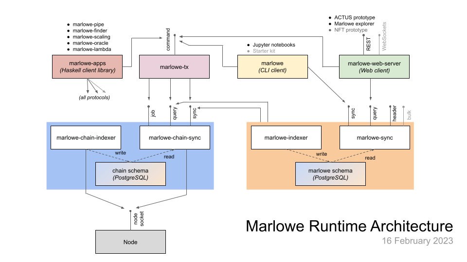

# Starter Kit for Marlowe Using Demeter.Run

This repository is meant to be used with [demeter.run](https://demeter.run) to execute Marlowe contracts using Marlowe Runtime. See the [Marlowe documentation](https://github.com/input-output-hk/marlowe-doc/blob/main/README.md) for more information on Marlowe and Marlowe Runtime.

## Marlowe Runtime Overview

Marlowe Runtime provides backend services for interacting with Marlowe contracts on the Cardano blockchain. There are several methods for executing Marlowe contracts:

- Via Marlowe Runtime
  -  REST API and (coming soon) WebSockets API using `marlowe-web-server` backend
  -  Command line using the `marlowe` tool
  -  JSON pipe using the `marlowe-pipe` tool
  -  Haskell code using the `marlowe-apps` library
- Via Marlowe CLI
  - Command line using `marlowe-cli run` (high-level interface)
  - Command line using `marlowe-cli transaction` (low-level interface)
- Via Cardano CLI
  - Command line using `cardano-cli transaction build`
  

## Lesson 1. Marlowe Runtime\'s Command-Line Interface

The backend services in Marlowe Runtime can be accesses via the command-line using the `marlowe` tool. The example [Zero-Coupon Bond Using Marlowe Runtime's Command-Line Interface](runtime-cli/zcb.ipynb) provides step-by-step instructions on running a contract on the `preprod` public testnet using `marlowe`.
